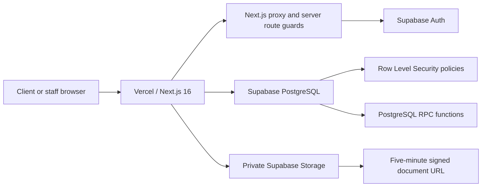
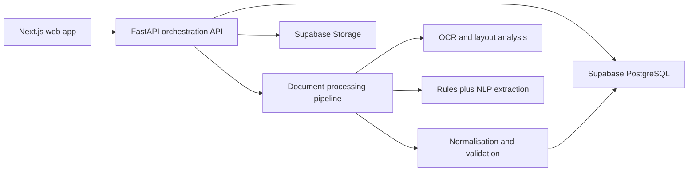
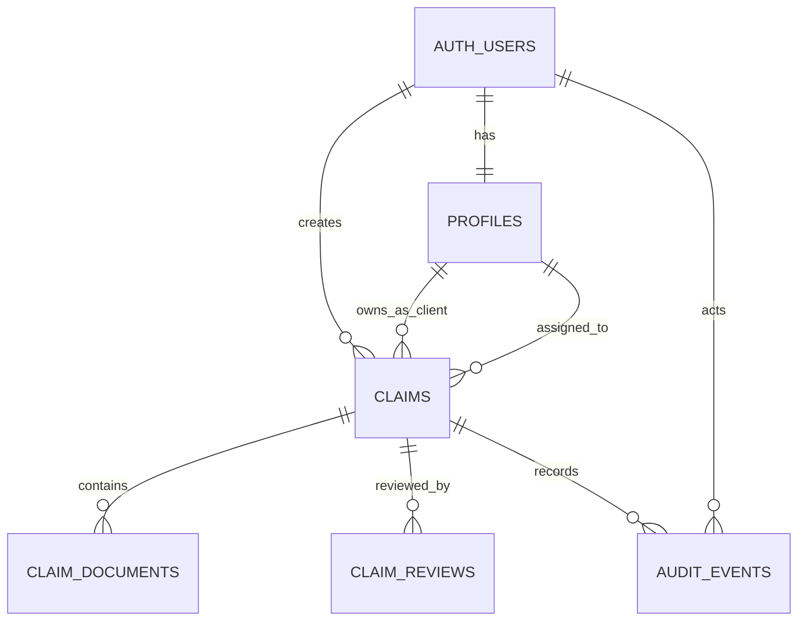

# ClaimLens AI

ClaimLens AI is an AI-assisted health-insurance claims platform and dissertation research prototype. It combines a secure, role-based claims workflow with a reproducible document-extraction research pipeline.

The central idea is not simply to run OCR. ClaimLens is designed around the complete accountable workflow:

```text
Health-claim documents
        ↓
Private upload and preservation
        ↓
OCR / text extraction
        ↓
Structured field extraction and normalisation
        ↓
Cross-document validation
        ↓
Evidence-linked human review
        ↓
Human verification and audit history
```

## Live application

- Production application: <https://claim-lens-ai-five.vercel.app>
- Public client registration: <https://claim-lens-ai-five.vercel.app/signup>
- GitHub repository: <https://github.com/zaynahamiraly/ClaimLens-AI>
- Production health endpoint: <https://claim-lens-ai-five.vercel.app/api/health>

> Important: public signup and email confirmation are implemented, but a custom SMTP provider must be connected to Supabase before confirmation emails can be delivered to arbitrary public addresses. Supabase's default mail service is intended only for project-team testing.

## 1. Viva-ready project summary

ClaimLens addresses the slow and error-prone process of manually reading claim forms, invoices, receipts, and supporting documents. The proposed solution extracts structured information, compares values across documents, shows the source evidence behind predictions, and keeps a human responsible for the final decision.

A concise viva description is:

> ClaimLens AI is a traceable, human-in-the-loop health-claims system. The deployed web platform provides secure client submission, private document storage, role-based staff workflows, assignment, verification, and audit history. The research component evaluates whether a quality-aware hybrid extraction pipeline can improve on a deterministic PDF-text-and-rules baseline. The novelty is the combination of extraction, validation, evidence localisation, human correction, and accountability—not the invention of OCR itself.

## 2. What is implemented now

ClaimLens has two connected but separately evaluated parts.

| Area | Current state | What it does |
|---|---|---|
| Next.js web application | Implemented and deployed | Signup, login, dashboards, claim submission, private uploads, queues, claim assignment, review access, verification, audit, analytics, and user administration |
| Supabase Auth | Implemented and live | Password authentication, email confirmation flow, secure sessions, account status, and automatic client profiles |
| Role-based access control | Implemented and live | Client, Claims Officer, Supervisor, and Administrator permissions enforced in UI, Server Actions, database functions, and Row Level Security |
| Supabase PostgreSQL | Implemented and live | Profiles, claims, document metadata, reviews, audit events, indexes, constraints, triggers, and security functions |
| Supabase Storage | Implemented and live | Private PDF/JPEG/PNG storage with short-lived signed document URLs |
| Pipeline A research baseline | Implemented locally | PyMuPDF text extraction, regular expressions, deterministic normalisation, and field-by-field evaluation |
| Synthetic golden dataset | Pilot implemented | One synthetic claim form, invoice, receipt, ground-truth JSON, hashes, and evidence bounding boxes |
| FastAPI service | Foundation only in the committed release | Root and health endpoints; it is not yet used by the deployed Next.js application |
| Live OCR/NLP worker | Not yet integrated | New production claims remain in `PROCESSING` until the planned document-processing service is connected |
| Pipeline B | Research design frozen; implementation pending | Quality assessment, adaptive preprocessing, layout-aware OCR, hybrid NLP, validation, and evidence localisation |
| Pipeline C / document VLM | Optional future experiment | Selective fallback for difficult or low-confidence documents |

This distinction prevents an important viva mistake: the live application workflow is real, but the cloud OCR/NLP worker is not yet processing newly uploaded claims.

## 3. Research problem and contribution

### 3.1 Problem

Health-insurance claim packages contain related information across several documents. A claim form may contain the claimed amount, an invoice the invoice total, and a receipt the paid amount. Reading each document manually is time-consuming, and a value can be misread or inconsistent with another document.

### 3.2 Proposed contribution

ClaimLens proposes a combined architecture with:

- document-quality-aware processing;
- OCR or PDF text extraction;
- hybrid deterministic and contextual field extraction;
- explicit raw and normalised values;
- cross-document validation;
- page and bounding-box evidence provenance;
- human correction without destroying the original prediction;
- human verification;
- an audit trail;
- reproducible comparison of alternative pipelines.

### 3.3 Research question

The main research question is:

> Does a traceable, quality-aware hybrid document-processing pipeline improve structured field extraction and human review support for synthetic health-insurance claim packages compared with a simpler PDF/OCR-and-rules baseline?

The frozen research definition and scoring rules are in [the implementation and evaluation contract](docs/implementation-evaluation-contract.md).

## 4. Current production architecture

The deployed application currently uses Next.js Server Components and Server Actions to communicate directly with Supabase.



### Why the browser does not directly receive secrets

- The browser receives only the Supabase URL and publishable key.
- Supabase sessions are managed using server-compatible cookies through `@supabase/ssr`.
- `SUPABASE_SECRET_KEY` is server-only and is used only for administrator account operations.
- The secret key is never prefixed with `NEXT_PUBLIC_`, so it is not bundled into browser JavaScript.
- Database Row Level Security remains the final data-access boundary even if a user manually calls the Supabase API.

### Where FastAPI fits

The intended extended architecture is:



The committed FastAPI service currently provides only foundation endpoints. The deployed web application therefore uses Supabase directly. This was an intentional staged delivery choice: first stabilise authentication, claims, private uploads, RBAC, and auditability; then connect the document-processing service.

## 5. Technology choices

| Layer | Technology | Reason for selection |
|---|---|---|
| Web framework | Next.js 16, React 19, TypeScript | Server rendering, Server Actions, route protection, type safety, and straightforward Vercel deployment |
| Validation | Zod | Validates untrusted form data before database operations |
| Authentication | Supabase Auth | Managed password accounts, sessions, confirmation emails, and server-side user administration |
| Database | Supabase PostgreSQL | Relational constraints, migrations, indexes, PostgreSQL functions, and Row Level Security |
| File storage | Supabase Storage | Private object bucket integrated with authentication policies |
| Production hosting | Vercel | Managed Next.js builds, environment variables, HTTPS, and production aliases |
| API foundation | FastAPI | Python-native orchestration layer suitable for later OCR/NLP integration |
| Baseline PDF extraction | PyMuPDF | Fast deterministic access to embedded PDF text and PDF coordinates |
| Baseline extraction | Python regular expressions and rules | Transparent, reproducible, and easy to compare against the proposed hybrid pipeline |
| Annotation validation | JSON Schema | Machine-checkable ground-truth structure and repeatable dataset validation |
| Planned OCR | PaddleOCR | OCR and layout-processing research path for scanned/degraded documents |
| Planned image processing | OpenCV | Quality assessment and controlled preprocessing |
| Planned NLP | spaCy plus deterministic rules | Contextual extraction where rules alone are insufficient |

## 6. User roles and permissions

ClaimLens supports four roles.

| Capability | Client | Claims Officer | Supervisor | Administrator |
|---|:---:|:---:|:---:|:---:|
| Register through public signup | Yes | No | No | No |
| View own profile | Yes | Yes | Yes | Yes |
| Submit a claim | Yes | Yes | Yes | Yes |
| View own claims | Yes | — | — | — |
| View operational claims | No | Yes | Yes | Yes |
| View private documents for permitted claims | Yes | Yes | Yes | Yes |
| Self-assign an unassigned claim | No | Yes | — | — |
| Assign a claim to any active Claims Officer | No | No | Yes | Yes |
| Review claims | No | Assigned claims | All claims | All claims |
| Verify a claim | No | Assigned claims | All eligible claims | All eligible claims |
| View operational audit trail | No | Yes | Yes | Yes |
| View analytics | No | No | Yes | Yes |
| Create, change, or deactivate users | No | No | No | Yes |

The table describes both interface behavior and database enforcement. Hiding a menu item is not considered security.

## 7. Public client registration flow

```text
Visitor opens /signup
        ↓
Enters full name, email, and a strong password
        ↓
Next.js Server Action validates the form with Zod
        ↓
Supabase Auth creates an unconfirmed user
        ↓
Database trigger creates profiles.role = client
        ↓
Supabase sends a confirmation email
        ↓
User opens /auth/callback through the email link
        ↓
Server exchanges the confirmation code for a session
        ↓
Client enters the protected dashboard
```

Security properties:

- The signup form contains no role selector.
- The database trigger always assigns `client` to new public users.
- Passwords must contain at least 12 characters, uppercase, lowercase, and a number.
- Email confirmation remains enabled.
- Auth redirect URLs are restricted to the production callback and local-development callback.
- Public users cannot promote themselves by changing browser requests because role changes require the administrator RPC and RLS permission.

For public delivery, configure custom SMTP under Supabase Authentication settings. Do not disable email confirmation as a shortcut.

## 8. Claim submission flow

### 8.1 What the user enters

The current claim form collects:

- patient name;
- healthcare provider name;
- between one and three supporting documents.

Accepted files are PDF, PNG, and JPEG, with a maximum application-level size of 6 MiB per file.

### 8.2 What happens on submission

1. `createClaim` calls `requireViewer` to require an authenticated, active profile.
2. Zod validates patient and provider names.
3. The action checks the number of files, reported MIME type, file size, and binary file signature.
4. A reference is generated in the form `CLM-YYYY-XXXXXXXX` using the year and a random UUID fragment.
5. A `claims` record is created with status `PROCESSING`.
6. For a client, `client_id` is set to that client's profile ID.
7. Each object is stored under a generated path:

   ```text
   user_uuid/claim_uuid/random_uuid-sanitised_filename
   ```

8. Metadata is written to `claim_documents`.
9. A `CLAIM_CREATED` audit event records the document count.
10. The dashboard and claims pages are revalidated and the user is redirected to the claims queue.

### 8.3 Failure compensation

The upload sequence is designed to avoid silent partial claims. If a storage, metadata, or audit operation fails:

- already uploaded objects are removed;
- the incomplete claim row is deleted;
- the user receives a controlled error;
- the claim is not presented as successfully submitted.

This is application-level compensation for a workflow that spans PostgreSQL and object storage and therefore cannot be one ordinary database transaction.

## 9. Claim lifecycle

The current PostgreSQL enum contains these states:

| Status | Meaning |
|---|---|
| `UPLOADED` | Documents have been received but processing has not started |
| `PROCESSING` | The claim is waiting for or undergoing document processing |
| `REVIEW_REQUIRED` | Structured results require accountable human review |
| `VERIFIED` | An authorised human has verified the claim |
| `PROCESSING_FAILED` | Processing failed in a controlled manner |

New live claims currently enter `PROCESSING`. Because the cloud OCR/NLP worker is not yet connected, the application does not falsely generate extraction results or move them automatically to `REVIEW_REQUIRED`.

## 10. Assignment and verification

### Assignment

The `assign_claim` PostgreSQL function performs the authoritative assignment:

- Clients cannot call it.
- A Claims Officer can assign only an unassigned claim and only to themselves.
- A Supervisor or Administrator can assign a claim to any active Claims Officer.
- The assignee must have role `claims_officer` and status `active`.
- A successful assignment creates a `CLAIM_ASSIGNED` audit event.

### Verification

The `verify_claim` function makes verification atomic:

- the caller must be a Claims Officer, Supervisor, or Administrator;
- the claim must be in `REVIEW_REQUIRED`;
- a Claims Officer must be the assigned officer;
- the claim status becomes `VERIFIED`;
- a `claim_reviews` record is inserted;
- a `CLAIM_VERIFIED` audit event is inserted.

Putting these related operations in one PostgreSQL function prevents a verified status without its corresponding review and audit records.

## 11. Authentication and route protection

Authentication is enforced in several layers.

### Layer 1: Next.js proxy

`apps/web/lib/supabase/proxy.ts` refreshes the Supabase session and protects all routes except:

- `/login`;
- `/signup`;
- `/auth/callback`;
- `/api/health`.

Unauthenticated requests are redirected to `/login?next=...`. Authenticated users visiting login or signup are redirected to the dashboard.

### Layer 2: server page guards

- `requireViewer()` loads the Auth user and matching `profiles` row.
- Missing or invalid sessions redirect to login.
- Missing profiles produce a controlled profile error.
- Inactive profiles are signed out.
- `requireRole([...])` protects staff-only routes and redirects denied users.

### Layer 3: Server Actions

Every sensitive mutation checks authentication or role again. Server Actions are treated like API endpoints, not trusted merely because a button is hidden.

### Layer 4: PostgreSQL RLS and functions

Supabase applies Row Level Security to profiles, claims, documents, reviews, audit events, and storage objects. This is the final protection against direct API calls.

## 12. Database design

### 12.1 Main tables

| Table | Purpose | Important fields |
|---|---|---|
| `auth.users` | Supabase-managed identity | Email, encrypted credentials, confirmation, ban status |
| `profiles` | Application identity and RBAC | `display_name`, `role`, `status` |
| `claims` | Main business record | Reference, creator, client, assignee, patient, provider, amount, currency, status, warning count |
| `claim_documents` | Metadata for private files | Claim, uploader, type, original name, storage path, MIME type, size |
| `claim_reviews` | Human review record | Claim, reviewer, status, comments, start and finish times |
| `audit_events` | Append-only business history | Claim or user subject, actor, event type, JSON metadata, timestamp |
| `storage.objects` | Supabase-managed stored object metadata | Private bucket, path, owner, object metadata |

### 12.2 Relationships



### 12.3 Important database functions

| Function | Responsibility |
|---|---|
| `private.current_role()` | Returns the caller's active application role |
| `private.is_active_user()` | Confirms that the caller has an active profile |
| `private.can_access_claim(uuid)` | Centralises claim visibility rules |
| `public.assign_claim(text, uuid)` | Validates and records claim assignment |
| `public.verify_claim(text)` | Atomically verifies the claim and records review/audit data |
| `public.admin_update_user_profile(...)` | Allows administrators to change role/status and records the event |

### 12.4 Migration order

Run migrations in this order:

1. `supabase/migrations/202608120001_web_mvp.sql`
2. `supabase/migrations/202608120002_production_hardening.sql`
3. `supabase/migrations/202608130001_role_based_access.sql`

The schema is changed through migrations rather than manual production edits, which makes the system reproducible and auditable.

## 13. Row Level Security explained

RLS answers the question, “Even if this user sends a direct database request, which rows may they access?”

Examples from the current policy model:

- A Client can read a claim only when they are its `client_id` or creator.
- Staff can see operational claims.
- A Claims Officer can update only a claim assigned to them.
- A Supervisor or Administrator can update permitted claims.
- A document is readable only if `private.can_access_claim(document.claim_id)` is true.
- Storage is private; a stored object is readable only when its metadata links it to an accessible claim.
- Only an Administrator can call the administrator profile-update function.
- An Administrator cannot demote or deactivate their own administrator profile.
- Anonymous database access is revoked from core tables.

This is stronger than frontend-only RBAC because changing HTML, JavaScript, or a URL cannot bypass PostgreSQL policy evaluation.

## 14. Private document security

ClaimLens applies several controls to uploaded documents:

- private `claim-documents` bucket;
- authenticated uploads only;
- owner-scoped generated folder paths;
- one to three files per current claim form;
- 6 MiB per-file application limit;
- PDF, PNG, and JPEG allow-list;
- magic-byte signature verification to detect simple MIME spoofing;
- Unicode filename normalisation;
- unsafe filename characters replaced;
- random internal object names;
- metadata stored separately from the binary object;
- Row Level Security checks claim access;
- document links expire after 300 seconds;
- no service key in the browser.

The original file is not modified by the upload step. Preserving originals is important for evidence, reproducibility, and later processing experiments.

## 15. Administrator workflow

An Administrator can open `/admin/users` to:

- list workspace users;
- create a user with a temporary password;
- choose Client, Claims Officer, Supervisor, or Administrator role;
- modify display name;
- change role;
- activate or deactivate access.

Account creation uses the server-only Supabase admin client. If profile configuration fails after Auth user creation, the action deletes the partial user so an unsecured account is not retained.

Deactivation is applied to both the application profile and Supabase authentication account. Role/status changes create audit events. The current Administrator cannot remove their own administrator access through the form or database function.

## 16. Audit trail

Audit events record who performed an important action and when it happened. Current event types include:

- `CLAIM_CREATED`;
- `CLAIM_ASSIGNED`;
- `DOCUMENT_UPLOADED`;
- `PROCESSING_STARTED`;
- `PROCESSING_COMPLETED`;
- `PROCESSING_FAILED`;
- `FIELD_CORRECTED`;
- `REVIEW_STARTED`;
- `CLAIM_VERIFIED`;
- `USER_CREATED`;
- `USER_ROLE_CHANGED`;
- `USER_STATUS_CHANGED`.

Not every planned event is emitted by the current web release. The schema is ready for the later processing and correction workflow. Claim-specific history is shown on the claim page, while authorised staff can see recent operational events on `/audit`.

## 17. Web routes

| Route | Access | Purpose |
|---|---|---|
| `/` | Entry redirect | Routes to the dashboard; the proxy sends unauthenticated visitors to login |
| `/login` | Public | Password sign-in |
| `/signup` | Public | Creates a public Client account |
| `/auth/callback` | Public callback | Exchanges the Supabase email-confirmation code for a session |
| `/api/health` | Public | Deployment health response |
| `/dashboard` | Authenticated | Role-aware overview and live operational counts |
| `/claims` | Authenticated | Client “My claims” or staff claims queue |
| `/claims/new` | Authenticated | Claim details and private document submission |
| `/claims/[reference]` | Claim access required | Claim ownership, assignment, document link, and audit history |
| `/claims/[reference]/review` | Review roles | Human review and verification |
| `/review-queue` | Staff | Claims in `REVIEW_REQUIRED` |
| `/audit` | Staff | Recent permitted audit events |
| `/analytics` | Supervisor/Admin | Live operational metrics |
| `/admin/users` | Administrator | Account provisioning, role assignment, and deactivation |

## 18. Source-code map

```text
ClaimLens AI/
├── apps/
│   └── web/                         # Deployed Next.js application
│       ├── app/
│       │   ├── (workspace)/         # Authenticated application routes
│       │   ├── api/health/          # Public health endpoint
│       │   ├── auth/callback/       # Email-confirmation callback
│       │   ├── login/               # Login page, form, and Server Action
│       │   └── signup/              # Public registration page and Server Action
│       ├── components/              # Shell, tables, status and review UI
│       ├── lib/
│       │   ├── auth.ts              # Viewer/profile and role guards
│       │   ├── claims.ts            # Server-side claim reads and DTO mapping
│       │   ├── audit.ts             # Audit reads and display-name hydration
│       │   ├── users.ts             # Admin profile reads and officer listing
│       │   ├── permissions.ts       # Role labels and capability helpers
│       │   └── supabase/            # Browser, server, admin, and proxy clients
│       └── proxy.ts                 # Next.js 16 request proxy entry point
├── services/
│   └── api/                         # FastAPI foundation for future orchestration
├── supabase/
│   └── migrations/                  # PostgreSQL schema, RLS, and RPC history
├── datasets/
│   ├── golden/                      # Synthetic golden claim packages
│   ├── schemas/                     # Ground-truth JSON Schema
│   ├── raw/                         # Reserved raw dataset area
│   ├── variants/                    # Reserved degradation variants
│   └── results/                     # Generated experiment outputs
├── experiments/
│   ├── pipeline_a/                  # Deterministic baseline implementation
│   ├── pipeline_b/                  # Proposed hybrid pipeline area
│   └── pipeline_c/                  # Optional VLM experiment area
├── scripts/                         # Dataset generation, validation and evaluation
└── docs/                            # Evaluation contract and deployment guide
```

### Most important files for explaining the application

| File | What to explain in the viva |
|---|---|
| `apps/web/lib/supabase/proxy.ts` | Session refresh and public/protected route decision |
| `apps/web/lib/auth.ts` | Active profile lookup and server-side role guards |
| `apps/web/app/signup/actions.ts` | Secure public signup without a client-controlled role |
| `apps/web/app/(workspace)/claims/actions.ts` | Validation, reference generation, private upload, compensation, assignment, and verification calls |
| `apps/web/lib/claims.ts` | RLS-backed claim queries and short-lived document URLs |
| `apps/web/app/(workspace)/admin/users/actions.ts` | Server-only Auth administration and role updates |
| `supabase/migrations/202608130001_role_based_access.sql` | Roles, policies, triggers, assignment, verification, and admin functions |
| `experiments/pipeline_a/baseline.py` | Transparent deterministic research baseline |
| `scripts/run_pilot_evaluation.py` | Automatic comparison of predictions with frozen ground truth |
| `datasets/schemas/ground-truth.schema.json` | Formal annotation contract |

## 19. Research pipeline

### 19.1 Pipeline A: implemented baseline

```text
Digital PDF
    ↓
PyMuPDF embedded-text extraction
    ↓
Label/regular-expression rules
    ↓
Deterministic date and money normalisation
    ↓
Structured field dictionary with source text
```

Pipeline A is deliberately simple and explainable. It reads the embedded text layer of the synthetic PDFs and uses rules such as label matching, date parsing, amount parsing, and known service-description detection.

It is not yet a full OCR system. A scanned image without a text layer requires the future OCR path.

### 19.2 Pipeline B: proposed ClaimLens pipeline

```text
Document
    ↓
Quality assessment
    ↓
Recorded adaptive preprocessing
    ↓
PDF text extraction or layout-aware OCR
    ↓
Rules plus contextual NLP
    ↓
Normalisation
    ↓
Cross-document validation
    ↓
Evidence localisation
    ↓
Human review routing
```

Pipeline B is the dissertation's proposed architecture. It must eventually be evaluated on exactly the same locked cases as Pipeline A.

### 19.3 Pipeline C: optional extension

Pipeline C adds a selective document-VLM fallback only for predefined difficult or low-confidence cases. It is optional and must not delay Pipeline B or the core evaluation.

## 20. Ground truth and synthetic data

Real patient documents are not used. The repository includes a fully synthetic pilot package:

```text
datasets/golden/CLM-GOLD-001/
├── claim_form.pdf
├── invoice.pdf
├── receipt.pdf
└── ground_truth.json
```

The annotation records:

- dataset and schema versions;
- case ID and dataset split;
- template family;
- document type, filename, SHA-256 hash, and condition;
- canonical field values;
- source document;
- one-based page number;
- normalised bounding box `[x_min, y_min, x_max, y_max]`;
- raw source text;
- expected validation outcomes.

The 12 evaluated fields are:

1. claim reference;
2. member number;
3. patient name;
4. provider name;
5. invoice number;
6. invoice date;
7. service date;
8. claimed amount;
9. invoice total;
10. receipt amount;
11. currency;
12. service description.

The generator creates deterministic synthetic PDFs and then calculates hashes and evidence coordinates from the generated documents. The validator checks JSON Schema compliance, required document types, file hashes, document references, and bounding-box ordering.

## 21. Pilot result and how to present it

The current single-case Pipeline A pilot extracts 12 of 12 fields correctly from one clean, digitally generated package.

This must be described carefully:

> The pilot confirms that the generator, ground-truth schema, deterministic baseline, and evaluation script work end to end on one controlled case. It is not evidence of 100% real-world accuracy. Final claims require a larger frozen test set with unseen layouts and degraded/scanned variants.

Do not present the pilot processing time as a general system benchmark. It varies by machine and run and covers only local baseline extraction, not upload, OCR, NLP, or network time.

## 22. Evaluation protocol

The frozen protocol includes:

- required-field exact-match accuracy;
- per-field accuracy;
- precision, recall, and F1;
- OCR Character Error Rate and Word Error Rate where transcription exists;
- validation precision, recall, F1, and false-positive rate;
- evidence-localisation success;
- processing latency and failure rate;
- human correction rate and review duration;
- confidence reliability bins and possible Brier score when calibrated probabilities exist.

Both pipelines must process the same test claim packages. The final test set is split by provider/template family to reduce template leakage. No scoring rule may be changed after final evaluation starts.

## 23. The AI review workspace

The review screen is intended to be the signature human-in-the-loop feature. It places the source document beside extracted fields, validation warnings, and evidence indicators.

The current `ReviewWorkspace` is a synthetic UI demonstration for the golden example. It demonstrates the intended interaction:

- select an extracted field;
- see its value and confidence presentation;
- highlight the corresponding source area;
- show a cross-document warning;
- preserve the concept of evidence-linked predictions.

The confidence percentages shown in this demonstration are synthetic interface values, not calibrated model probabilities or dissertation results.

For ordinary live claims, the screen honestly reports that structured fields are not yet available and keeps verification disabled while status is `PROCESSING` or `UPLOADED`.

The planned correction workflow will store the original prediction, corrected value, correction category, reviewer, and timestamp rather than overwriting the AI result.

## 24. Operational analytics

The live Analytics page is available only to Supervisors and Administrators. It calculates:

- claims processing;
- review backlog;
- verified claims;
- assignment rate;
- processing failures.

These values come from live claims. Research statistics such as extraction accuracy, OCR error rate, and confidence calibration are intentionally not shown until frozen evaluation data exists.

## 25. Local setup

### 25.1 Prerequisites

- Git;
- Node.js compatible with Next.js 16;
- npm;
- Python 3.11+ recommended for research scripts;
- a Supabase project for live mode;
- optional Supabase CLI and Vercel CLI.

### 25.2 Clone the repository

```powershell
git clone https://github.com/zaynahamiraly/ClaimLens-AI.git
Set-Location 'ClaimLens-AI'
```

### 25.3 Configure the web application

```powershell
Set-Location apps\web
Copy-Item .env.example .env.local
npm install
```

Set these values in `apps/web/.env.local`:

```dotenv
NEXT_PUBLIC_SUPABASE_URL=https://your-project.supabase.co
NEXT_PUBLIC_SUPABASE_PUBLISHABLE_KEY=your-publishable-key
NEXT_PUBLIC_SITE_URL=http://localhost:3000
SUPABASE_SECRET_KEY=your-server-secret-key
NEXT_PUBLIC_DEMO_MODE=false
```

Never commit `.env.local`. Never rename `SUPABASE_SECRET_KEY` to a `NEXT_PUBLIC_` variable.

### 25.4 Apply the database schema

Use the Supabase SQL Editor to run the three migrations in order. Also configure:

- Authentication Site URL;
- allowed `/auth/callback` redirect URL;
- custom SMTP for public confirmation emails.

### 25.5 Run the web application

```powershell
Set-Location apps\web
npm run dev
```

Open <http://localhost:3000>.

### 25.6 Run quality checks

```powershell
Set-Location apps\web
npm run check
```

`npm run check` performs:

1. ESLint;
2. TypeScript type checking without emission;
3. an optimised Next.js production build.

### 25.7 Optional synthetic demo mode

Set:

```dotenv
NEXT_PUBLIC_DEMO_MODE=true
```

Demo mode provides synthetic UI data without live Supabase writes. It must remain `false` in production.

## 26. Research setup and commands

From the repository root:

```powershell
py -m venv .venv
.\.venv\Scripts\python -m pip install -r requirements-research.txt
```

Validate the golden annotation and document hashes:

```powershell
.\.venv\Scripts\python scripts\validate_ground_truth.py datasets\golden
```

Regenerate the synthetic golden package:

```powershell
.\.venv\Scripts\python scripts\generate_golden_claim.py
.\.venv\Scripts\python scripts\validate_ground_truth.py datasets\golden
```

Run Pipeline A and create JSON plus Markdown reports:

```powershell
.\.venv\Scripts\python scripts\run_pilot_evaluation.py
```

Generated outputs are placed under:

```text
datasets/results/pilot-pipeline-a/
├── results.json
└── report.md
```

## 27. FastAPI foundation

The committed API currently exposes:

- `GET /` — service name, version, and running status;
- `GET /api/v1/health` — health response.

To run it after installing its requirements:

```powershell
Set-Location services\api
..\..\.venv\Scripts\python -m pip install -r requirements.txt
..\..\.venv\Scripts\python -m uvicorn app.main:app --reload
```

Open <http://127.0.0.1:8000/docs> for FastAPI's generated OpenAPI interface.

This service is not currently called by the production web app. Its next responsibility is to orchestrate processing jobs and the document-AI pipeline.

## 28. Production deployment

### Vercel

- Framework: Next.js;
- Root directory: `apps/web`;
- Production alias: `claim-lens-ai-five.vercel.app`;
- demo mode: disabled.

Required Vercel variables:

| Variable | Visibility | Purpose |
|---|---|---|
| `NEXT_PUBLIC_SUPABASE_URL` | Public configuration | Supabase project URL |
| `NEXT_PUBLIC_SUPABASE_PUBLISHABLE_KEY` | Public configuration | Browser-safe Supabase key used with RLS |
| `NEXT_PUBLIC_SITE_URL` | Public configuration | Canonical signup/auth callback base URL |
| `NEXT_PUBLIC_DEMO_MODE` | Public configuration | Must be `false` in production |
| `SUPABASE_SECRET_KEY` | Sensitive server-only | Administrator Auth operations |

### Supabase Auth URL configuration

- Site URL: `https://claim-lens-ai-five.vercel.app`
- Production callback: `https://claim-lens-ai-five.vercel.app/auth/callback`
- Local callback: `http://localhost:3000/auth/callback`
- email confirmation: enabled.

See [the deployment guide](docs/web-deployment.md) for the concise deployment checklist.

## 29. Testing status

Currently exercised:

- ESLint;
- TypeScript checking;
- Next.js production build;
- production health endpoint;
- production signup route and form response;
- invalid confirmation callback redirect;
- migration rollback/apply verification;
- authenticated RLS checks for Client, Claims Officer, Supervisor, and Administrator;
- ground-truth JSON Schema and semantic validation;
- Pipeline A field-by-field pilot evaluation.

Still required before the final dissertation release:

- committed Playwright end-to-end tests;
- automated Server Action integration tests;
- file-spoofing and storage-policy regression tests;
- Pipeline B unit/integration tests;
- larger frozen dataset evaluation;
- controlled degradation experiments;
- user acceptance testing;
- performance and error analysis.

## 30. Current limitations

Be direct about these in the viva:

1. The live web application does not yet invoke the FastAPI service.
2. Newly uploaded production documents are stored privately but are not yet processed by a cloud OCR/NLP worker.
3. The rich review workspace is currently a synthetic golden-case demonstration.
4. The baseline reads embedded PDF text and is not OCR for scanned images.
5. Pipeline B is designed but not yet implemented and benchmarked.
6. The dataset contains only one golden pilot package, so the pilot result cannot support general performance claims.
7. Public confirmation email needs custom SMTP before arbitrary users can complete signup.
8. Corrections, evidence records, OCR results, processing jobs, and model-run tables belong to the next processing release.
9. The current operational analytics are not AI-performance analytics.
10. This is a synthetic academic prototype, not a medical or insurance decision system approved for real patient data.

These limitations are not failures; they define the next implementation and evaluation work honestly.

## 31. Suggested viva demonstration

Use a controlled synthetic example and narrate each security and accountability decision.

### Part A: public client

1. Open the signup page.
2. Explain that public users are always assigned Client by the database trigger.
3. Sign in with a prepared Client account.
4. Show the Client-only navigation.
5. Submit patient/provider details and synthetic PDF documents.
6. Show the generated claim reference and `PROCESSING` state.
7. Show that the Client sees only their claims.

### Part B: staff workflow

1. Sign in as Supervisor or Administrator.
2. Show the broader claims queue.
3. Assign the claim to an active Claims Officer.
4. Explain the `assign_claim` database function and audit event.
5. Show audit history and private signed document access.

### Part C: research explanation

1. Open the synthetic Pipeline A review example.
2. Select an extracted field and explain source evidence.
3. Show the ground-truth JSON and bounding box.
4. Run the pilot evaluator.
5. Explain why one 12/12 pilot is a system check, not a final accuracy claim.
6. Explain how Pipeline B will be compared on the same frozen dataset.

### Part D: security demonstration

1. Explain proxy/session protection.
2. Explain server role guards.
3. Explain Row Level Security as the final data boundary.
4. Explain why the storage bucket is private.
5. Explain why the admin key stays server-side.

## 32. Common viva questions and answers

### What is novel about ClaimLens?

The novelty is not OCR alone. It is the integration of quality-aware document processing, hybrid extraction, cross-document validation, evidence localisation, human correction, verification, and audit history in one traceable workflow, plus a controlled comparison against a baseline.

### Why use a human-in-the-loop?

OCR and extraction can be wrong, especially with degraded documents or ambiguous layouts. Health claims affect people and money, so the system assists a reviewer and preserves evidence; it does not silently make the final decision.

### Why not use only an LLM?

Many fields such as dates, amounts, currencies, and identifiers are better handled with deterministic parsing and validation. Rules are transparent and reproducible. Contextual NLP or a VLM is reserved for cases where it adds measurable value.

### Why PostgreSQL?

Claims have structured relationships and integrity requirements. PostgreSQL provides transactions, foreign keys, constraints, indexes, enums, functions, and Row Level Security. These features are useful for atomic verification and secure per-user access.

### Why Supabase?

Supabase combines managed PostgreSQL, Auth, private storage, and RLS. It allowed the project to implement production-style security while keeping PostgreSQL visible and controllable through migrations.

### Why Next.js?

Next.js supports Server Components for protected reads, Server Actions for mutations, a request proxy for session handling, TypeScript, and direct Vercel deployment. Server-side logic also prevents secrets from being sent to the browser.

### Why is FastAPI present if Next.js uses Supabase directly?

Development is staged. The live workflow and security foundation were stabilised first. FastAPI is the planned orchestration layer for OCR/NLP jobs because the research stack is Python-based. The README does not pretend that this integration is already complete.

### How is RBAC enforced?

The sidebar is role-aware, but security does not depend on it. Pages use `requireRole`, Server Actions repeat checks, PostgreSQL functions validate the caller, and RLS controls which rows and storage objects the session may access.

### What happens if upload number two fails?

The action removes objects already uploaded and deletes the incomplete claim. The user receives an error instead of a partially successful claim.

### What happens if OCR is wrong?

The proposed review workflow shows the extracted value and its source. The reviewer corrects it, while the original prediction remains stored. The correction is attributed and audited for later error analysis.

### Why synthetic data?

Synthetic data avoids exposing real patient information and allows exact, known ground truth. The limitation is that synthetic results cannot automatically be generalised to real insurer documents.

### What does 12/12 mean?

It means the deterministic Pipeline A correctly extracted the 12 defined fields from one clean golden pilot package. It validates the experimental machinery only; it is not a claim of 100% production accuracy.

### How will Pipeline B be evaluated fairly?

Pipeline A and B will run on the same frozen test cases. Scoring rules and ground truth are fixed before final evaluation, and templates/providers are separated to reduce leakage.

### Why not show one overall “claim confidence” score?

An overall number would be difficult to justify without calibration. ClaimLens keeps OCR confidence, entity confidence, validation state, evidence state, and human-review state conceptually separate until experiments justify combining them.

### Can a public user register as Administrator?

No. The form never accepts a role, and the database trigger always creates new public profiles with role Client. Role changes require an authenticated Administrator and a protected database function.

## 33. Key terminology

| Term | Meaning in ClaimLens |
|---|---|
| OCR | Converting text in document images into machine-readable text |
| NLP | Extracting contextual entities such as patient/provider information from text |
| Normalisation | Converting raw values to canonical forms, such as `14/07/2026` to `2026-07-14` |
| Validation | Checking whether values and relationships are plausible or consistent |
| Evidence provenance | Recording the document, page, location, and raw text supporting an extracted value |
| Human-in-the-loop | A person reviews and confirms or corrects system output |
| RLS | PostgreSQL Row Level Security controlling accessible rows for each session |
| RPC | A PostgreSQL function called through Supabase, used for controlled multi-step operations |
| Golden case | A test package with known, validated expected values |
| Template leakage | Similar document templates appearing in both development/training and final test data, producing misleading results |
| Pipeline A | Deterministic baseline |
| Pipeline B | Proposed quality-aware hybrid method |
| Pipeline C | Optional document-VLM extension |

## 34. Troubleshooting

### The deployed URL returns 404

Confirm that the Vercel project Root Directory is `apps/web` and that the production alias points to the latest ready deployment.

### Login works but the workspace redirects back to login

Check that the authenticated user has a corresponding active `profiles` row and that all three database migrations were applied.

### Public signup does not send an email

Configure custom SMTP in Supabase Authentication settings. The default Supabase sender is not a production public-email service.

### The confirmation email opens localhost

Set the Supabase Site URL and allowed redirect URL to the production domain and `/auth/callback`. Also set `NEXT_PUBLIC_SITE_URL` in Vercel.

### Administrator user management fails

Confirm that `SUPABASE_SECRET_KEY` exists in the Vercel Production environment and is not exposed as a public variable.

### New claims stay in `PROCESSING`

This is expected in the current live release. The cloud OCR/NLP worker has not yet been connected.

### Supabase CLI database connection times out

The direct PostgreSQL pooler port may be blocked by the local network. Use the Supabase SQL Editor or an authenticated HTTPS management path to apply migrations rather than repeatedly waiting on a blocked TCP connection.

## 35. Next development priorities

The recommended order is:

1. configure production SMTP and CAPTCHA for public registration;
2. finalise the FastAPI processing API contract;
3. add processing-job and model-run migrations;
4. implement document classification and quality assessment;
5. implement scanned-document OCR with provenance;
6. freeze and benchmark Pipeline A on a larger dataset;
7. implement Pipeline B extraction and normalisation;
8. add validation and evidence tables;
9. implement correction history and full review records;
10. connect the worker to the live claim lifecycle;
11. add Playwright and backend integration tests;
12. freeze the final synthetic dataset and run dissertation experiments.

Pipeline C/VLM remains optional until the core workflow and Pipeline B evaluation are stable.

## 36. Documentation index

- [Implementation and evaluation contract](docs/implementation-evaluation-contract.md)
- [Contract amendments](docs/contract-amendments.md)
- [Web deployment guide](docs/web-deployment.md)
- [Ground-truth JSON Schema](datasets/schemas/ground-truth.schema.json)
- [Pipeline A implementation](experiments/pipeline_a/baseline.py)
- [Pilot evaluation runner](scripts/run_pilot_evaluation.py)

## 37. Academic and data-use notice

ClaimLens AI is an academic research prototype. Use synthetic documents only unless a separate, approved data-governance process exists. The application does not provide medical advice and must not be represented as an autonomous insurer decision engine.
